# Pyke3D
This is a 3D viewer based on the Vulkan API with Python bindings using Nanobind.

* this is a prototype. It may be a bit unstable if pushed to the limit but it generally works.
* tested with Python 3.12 on Ubuntu 24.04 and with Python 3.13 (single-threaded version) on Windows 11.
* tested with Vulkan 1.4.3 SDK, though, no features above 1.2 should be used.
* never touched a Mac, ever
* installation guides for Windows and Linux are at the end of this document

The viewer works on Linux and Windows and has custom windowing systems based on the Windows API and X11.

| A 3x3 window with 9 times the same objects rendered by 9 different and independent cameras. |
:-------------------------:|
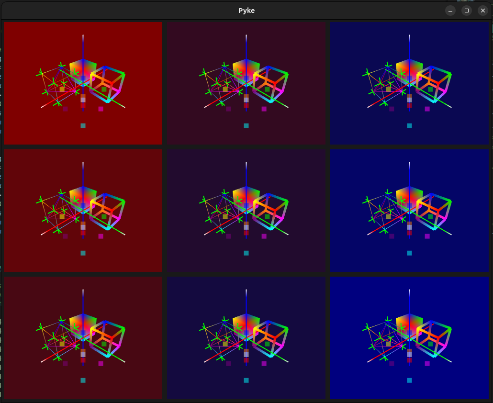{width=50%}  |

# Intention
* data can be transfered between CPU and GPU **without blocking**
* **debug points** in Python can be set anywhere in the script and examined without blocking the rendering process. The user can set a debug point in a Python script, change some 3D object represented as Numpy array and update the visualization without pressing 'continue'
* the **GUI** containing the cameras runs in a **separate thread**, managed by C++ (this is the main reason for the custom window implementations based on X11 and the Windows API)
* 3D objects can be transfered using Numpy arrays (in Python) or std::vector (in C++)
* computations can be performed inside of the main loop or inside of callback functions, both of which don't block the rendering process
* callback functions have a parameter ```repeat``` that causes the callback function to run again without using recursion
* slim API
* objects can be created separatedly and bound independently to one or multiple cameras as well as unbound, re-bound and updated individually at runtime
* all cameras can be moved separatly or in sync
* the rotation point of the cameras can be either an object (i.e a point in 3D space) or the camera origin
* save screenshots as jpeg using ctrl+s

# Shortcomings
* the graphics are limited to dots, lines and surfaces (no lights, the original usecase was limited to geometry and observing optimization processes)
* all cameras share the same frame buffer
* there is one central bottleneck, albeit a short one
* scenes can't be recorded
* terminating a Python script that runs the viewer causes some Vulkan API problems because Vulkan requires all parts to be destroyed in reversed order but the sequence in how Python destroys objects can't really be controlled.
* no mechanism for direct user interaction with the rendered objects using the mouse pointer (only zoom, pan and rotation)

# How to use
The two sample files `sample_viewer.cpp` and `test_py/test_vkviewer.py` showcase how the viewer works. The `test_py/test_vkviewer.py` contains a lot of comments while `sample_viewer.cpp` doesn't but essentially does exactly the same as the Python version.

The **only notable difference** is that Nanobind doesn't seem to support binding Python methods that belong to a class to C++. Thus, the callback methods in the Python script are defined outside of the test application while in the C++ example, they are inside of it.

(**Note**: more instructions for dependencies etc. are below)

* **C++**: sample_viewer.cpp
  Set CMakeLists.txt as follows:
  ```Cmake
  set(PYTHON_BUILD OFF)
  set(NB_TESTBUILD OFF)
  if (PYTHON_BUILD)
      message("Set PYVK (${CMAKE_CURRENT_SOURCE_DIR})==============================")
      add_compile_definitions(PYVK)
  endif()
  ```
  then select *sample_viewer* as build target. This requires Boost to be installed.
* **Python build**: test_py/test_viewer.py
  This way of building produces a Python extension without installing it to the current Python lib folder. The extension can be found inside the ./build folder.
  Configure CMakeLists.txt as follows:
  Set CMakeLists.txt as follows:
  ```Cmake
  set(PYTHON_BUILD ON)
  set(NB_TESTBUILD OFF)
  if (PYTHON_BUILD)
      message("Set PYVK (${CMAKE_CURRENT_SOURCE_DIR})==============================")
      add_compile_definitions(PYVK)
  endif()
  ```
  then select ```_pyke3d``` as build target. This does **not** require Boost to be installed.
* **Python module**: test_py/test_viewer.py
  This will build the module and install it in the current Python's lib folder.
  ```Cmake
  set(PYTHON_BUILD ON)
  set(NB_TESTBUILD OFF)
  if (PYTHON_BUILD)
      message("Set PYVK (${CMAKE_CURRENT_SOURCE_DIR})==============================")
      add_compile_definitions(PYVK)
  endif()
  ```
  then open a terminal (bash on Linux, cmd.exe on Windows) and run
  ```bash
  pip install . --verbose
  ```
  **Note**: the first time this runs, pip will download and install the requirements for the builder (requires internet connection).

### Requirements
##### Python
* Python 3.12++: tested with Python 3.12 on Linux and 3.13 (single-threaded version) on Windows 11
* Numpy: data handling in Python uses Numpy
* Scipy: this is required to run the test script *test_viewer.py*, some test data uses Scipy to rotate in put vertices
##### C++
* Boost: for the unit tests

-------------------------------------------------------------------

# How to Build and/or install
All installation steps are included. If C++ and Python are already set-up, most steps can be omitted.

### Linux (Ubuntu 24.04)
1. Install a C++ compiler first. Maybe best not pick the very newest versions.
   ```bash
   sudo apt-get install gcc-13
   sudo apt-get install g++-13
   ```
2. Install X11 GUI dependencies. Currently only X11 is supported.
   ```bash
   sudo apt-get install libx11-dev libxpm-dev libxft-dev libxext-dev mesa-common-dev
   ```
3. Install an IDE that supports both Python and C++, for example VSCode
4. Install CMake
   ```bash
   sudo apt-get install cmake
   ```
5. Download Vulkan SDK
   Follow the instructions on https://vulkan.lunarg.com/doc/view/latest/linux/getting_started_ubuntu.html
6. Download Boost
   ```bash
   sudo apt-get install libboost-all-dev
   ```
7. Download GLM
   ```bash
   sudo apt-get install libglm-dev
   ```
8. Check out this repository. Make sure to initialize the submodule with Nanobind
9.  Open a terminal inside the main folder (Pyke)
10. Create a virtual environment for Python or activate an existing one
    ```bash
    sudo apt-get install python3-virtualenv
    mkdir /home/[user]/.venvs
    virtualenv /home/[user]/.venvs/standard
    ```
    and activate it
    ```bash
    source /home/[user]/.venvs/standard/bin/activate
    ```
11. run
    ```bash
    pip install . --verbose
    ```
    or build for C++ using the target `sample_viewer`

-------------------------------------------------------------------

## Windows (Windows 11)
1. Download Visual Studio and Visual Studio Code
   1. Download the latest Visual Studio Community and Visual Studio Code versions. For Windows, installing Visual Studio is the least cumbersome way to install a C++ compiler. Since you do the Windows build, you automatically have enough storage space on your disk. Install VSCode to work CMake.
      <div style="text-align: center">
         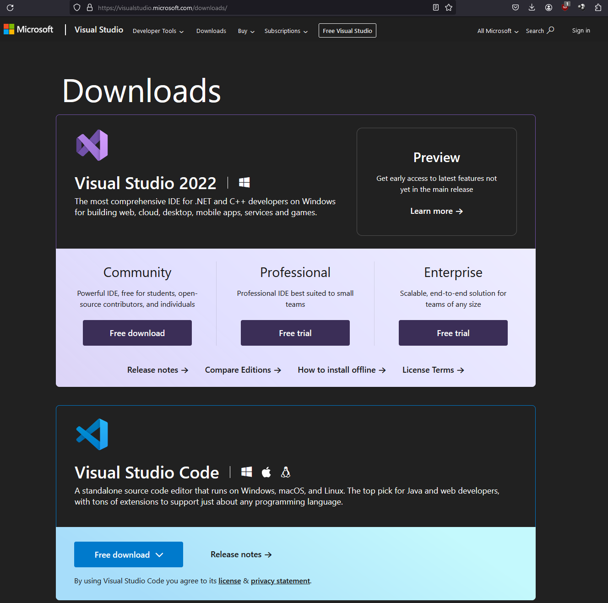
         <figcaption></figcaption>
         <br>
      </div>
   2. Install CMake: goto cmake.org/download/ and get the latest Windows binaries
      <div style="text-align: center">
         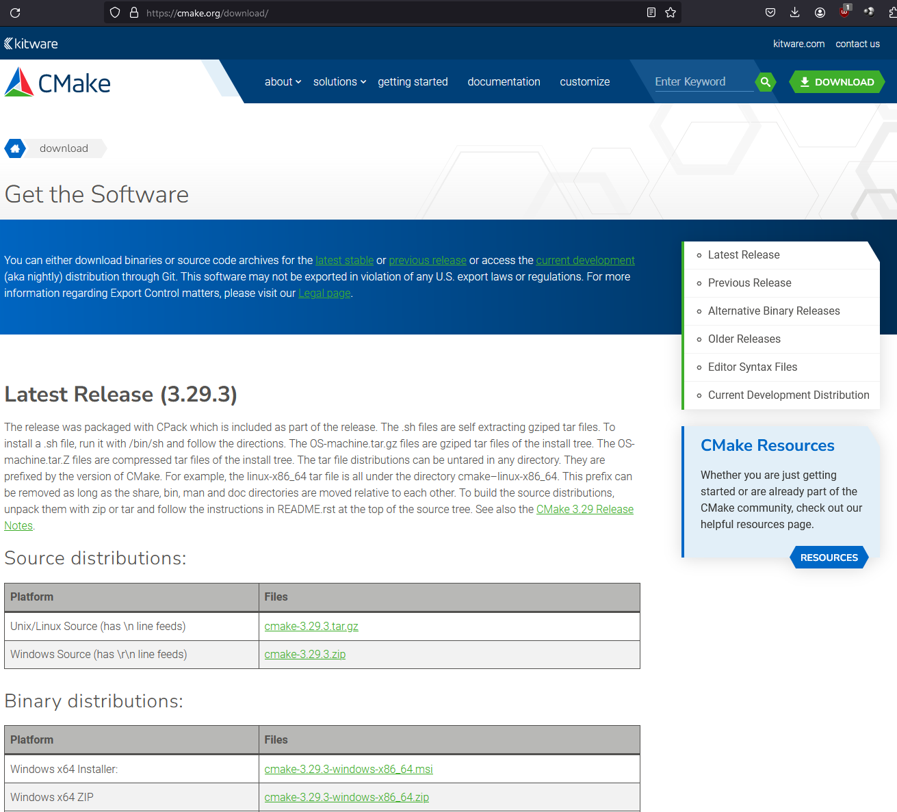
         <figcaption></figcaption>
         <br>
      </div>   
   3. Add a CMake extensions for VSCode. 
      <div style="text-align: center">
         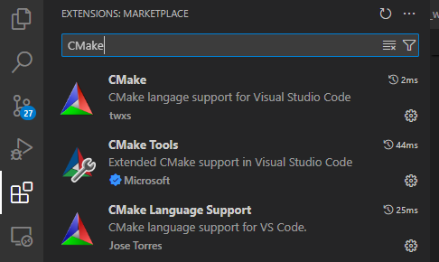
         <figcaption></figcaption>
         <br>
      </div>
   
      Right after installing *CMake Tools*, VSCode will prompt some configuration for visibility. Follow the prompt and set **Visibility** to **visible**. This will allways show the build options at the bottom of VSCode.
      <div style="text-align: center">
         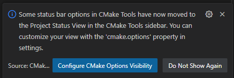
         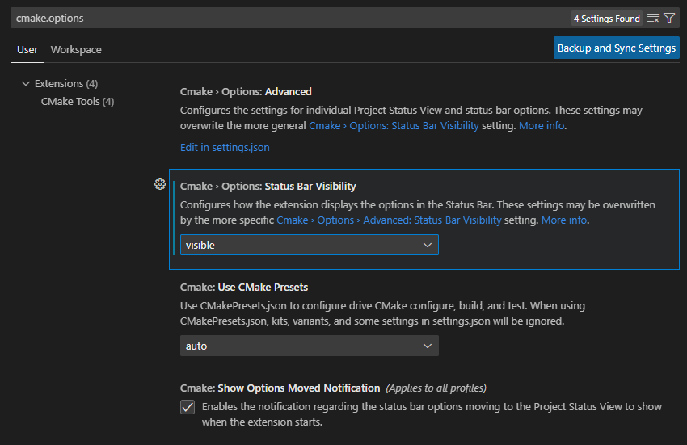
         
         <figcaption></figcaption>
         <br>
      </div>

2. Download Vulkan SDK
   1. Goto https://www.lunarg.com/vulkan-sdk/ and download the newest SDK
      <div style="text-align: center">
         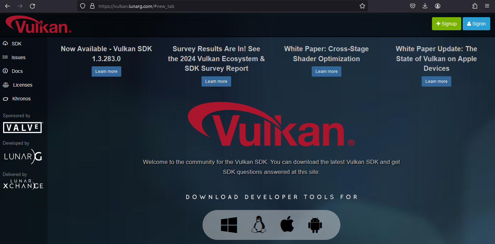
         <figcaption></figcaption>
         <br>
      </div>
   2. Follow the instructions on https://vulkan.lunarg.com/doc/sdk/1.4.313.0/windows/getting_started.html (especially the **Install the SDK** part). The current Vulkan SDK installation setup seems to take care of everything. If something doesn't work, it's probably related to environmental variables.
   3. Add environment variables for the **validation layers**. Make sure to adjust for the correct version!
      ```
      C:\> set VK_LAYER_PATH=C:\Libraries\VulkanSDK\1.3.211.0\Bin
      C:\> set VK_INSTANCE_LAYERS=VK_LAYER_LUNARG_api_dump;VK_LAYER_KHRONOS_validation
      ```
   4. Run the following to see if the installation works and your system supports Vulkan
      ```
      C:\> vkcube
      ```
   5. CMakeLists.txt configuration should now find the correct boost installation. Test by **deleting CMAKE cache and reconfigure**.
   
3. Download Boost
   (Source: https://www.geeksforgeeks.org/how-to-install-c-boost-libraries-on-windows/)
   1. Goto boost.org and download the newest Windows binaries
   2. Create a folder **C:\Boost**
   3. Extract the downloaded zip folder into **C:\Boost**. This will take a while. Go get a coffee (provided you drink such things. Otherwise go get a cup of tea)! Make sure, the folder looks like on the image below. **Not** C:\Boost\boost_1_85_0 or similar.
      <div style="text-align: center">
         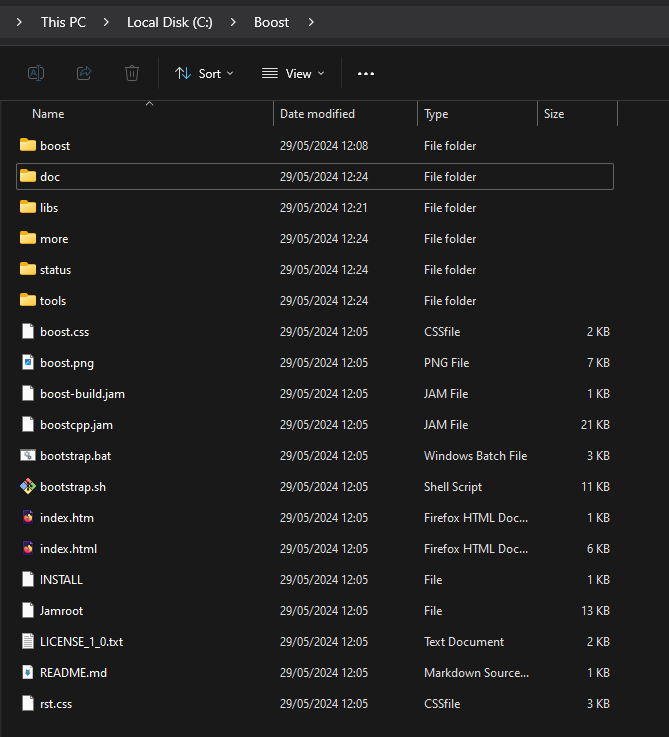
         <figcaption></figcaption>
         <br>
      </div>
   4. Create a new environment variable **Boost_INCLUDE_DIR=C:\Boost\include** (or to wherever else you put the boost files)
   5. Maybe reboot the system or not (as usual in Windows). **Note:** more environment variables follow. Reboot the system (or not) at the end of the installation instructions.
   6. CMakeLists.txt configuration should now find the correct boost installation. Test by **deleting CMAKE cache and reconfigure**. (**Note**: it is not necessary to add library link path here because the required parts of Boost are header-only)

4. Download GLM
   1. Godo https://glm.g-truc.net. You will be redirected to github.
   2. Select the latest, highlighted release and then download glm-[version]-light.zip
      <div style="text-align: center">
         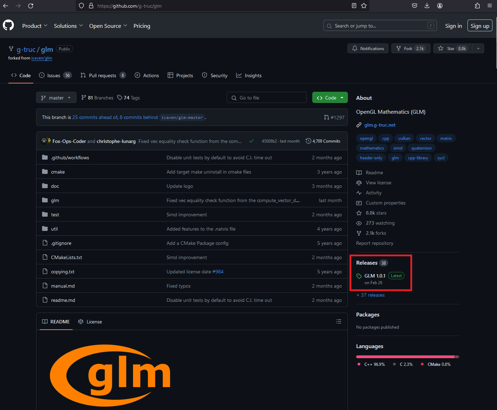
         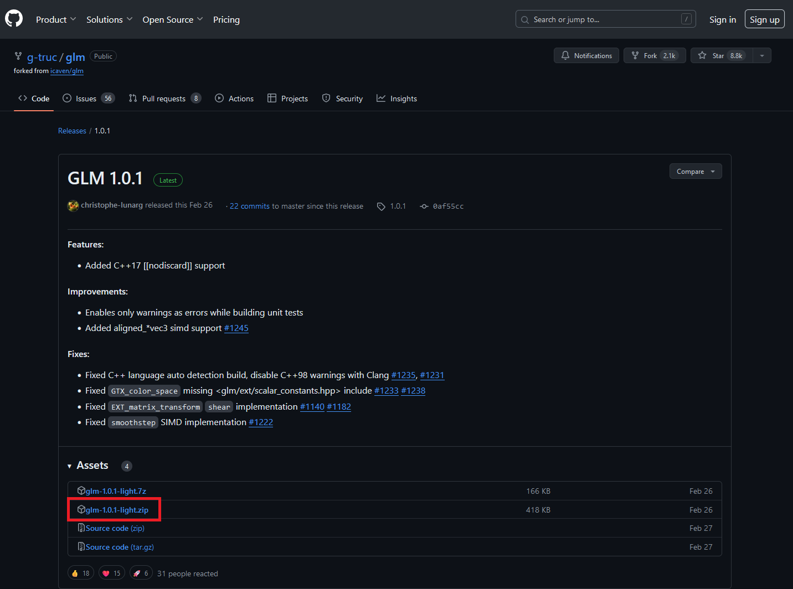
         <figcaption></figcaption>
         <br>
      </div>
   3. Extract the contents into a random target location, for example C:\Libraries\glm\glm. **Note** that **glm** appears **twice**. This is intentional and will result in
      ```
      #include "glm/glm.hpp"
      #include "glm/gtc/matrix_transform.hpp"
      ...etc...
      ```
      This matches what everyone else does and what you need, if you download the full github repository instead of the source code light zip.
   4. Create an environment variable **glm_INCLUDE_DIRS** and point it to the **first** ../glm/.. of the glm library location.
      <div style="text-align: center">
         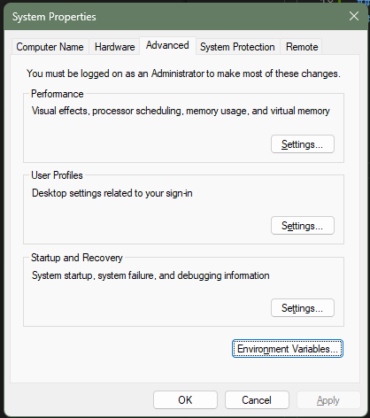
         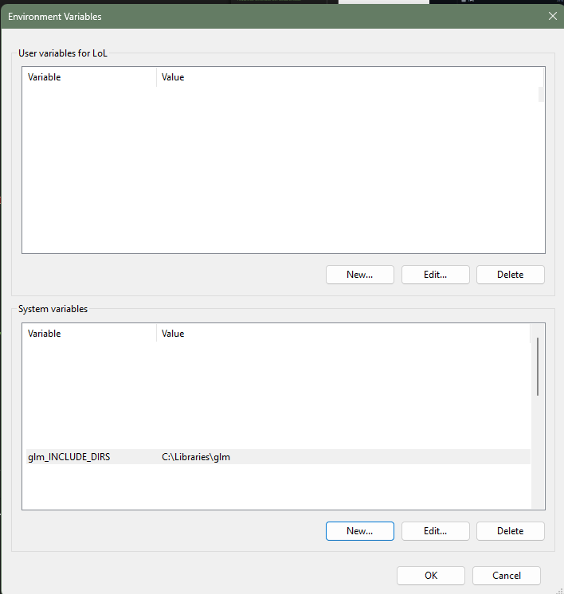
         <figcaption></figcaption>
         <br>
      </div>
   5. Maybe reboot the system or not (as usual in Windows)
   6. The CmakeLists.txt configuration should now set the correct paths for compilation. Test by **deleting CMAKE cache and reconfigure**.
5. Check out this repository and open it in VSCode
6. Run CMake configuration and hope that there are no errors   
7. Open a ```cmd``` terminal inside the main folder and run
   ```
   pip install . --verbose
   ```
   or compile in C++ using the build target ```sample_viewer```
