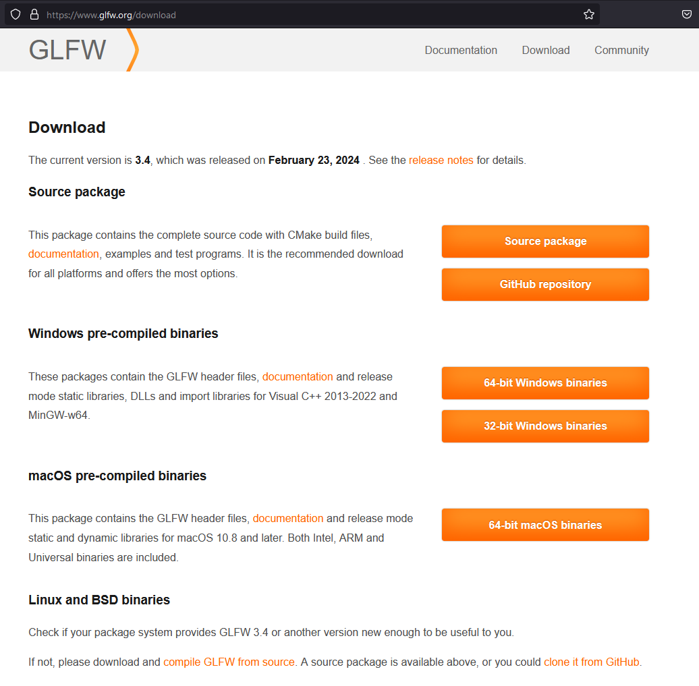
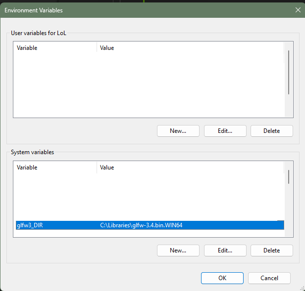
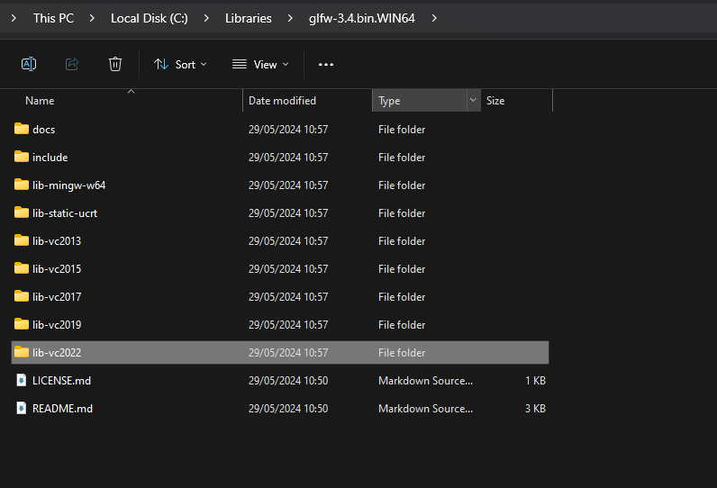
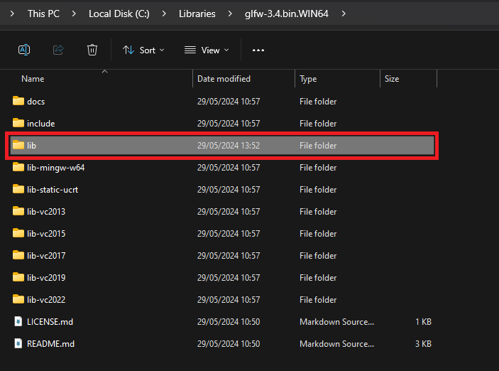
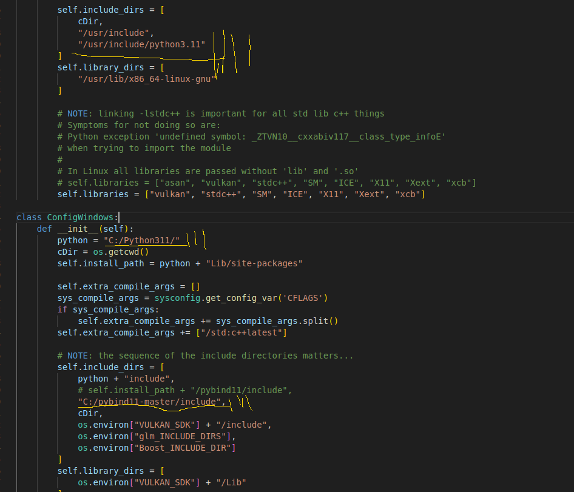

# Introduction
This is a 3D viewer based on the Vulkan API with Python bindings.

**Note:** This is a prototyle. It may be a bit unstable.
**Note**: The Python bindings use Nanobind.
**Note**: Tested up to Python 3.12.
**Note**: MacOs is not supported.

The viewer should work on Linux and Windows and has custom windowing systems based on the Windows API and X11. It has never been tested on a Mac and will probably not work there out-of-the-box.

<div style="text-align: center">
   
   <figcaption>A 3x3 window with 9 times the same objects rendered by 9 different and independent cameras.</figcaption>
   <br>
</div>

# Intention
* data can be transfered between CPU and GPU without blocking
* debug points in Python can be set anywhere in the script and examined without blocking the rendering process. The user can debug a Python script while examining the rendered objects without interruption
* the GUI containing the cameras runs in a separate thread, managed by C++ (this is the main reason for the custom window implementations)
* 3D objects can be transfered using Numpy arrays (in Python) or std::vector (in C++). No need for an external library (Thank You for the new Nanobind ndarray!!). Enable drawing with Numpy on a GPU accelerated surface.
* computations can be performed inside of the main loop or inside of callback functions
* callback functions have a parameter ```repeat``` that causes the callback function to run again. Note: this is not a recursive mechanism. ```repeat``` maps to a cpp lambda function that re-enqueues the current callback into the queue for an execution thread.
* the API is slim and comprehensive
* objects can be created separatedly and bound independently to one or multiple cameras as well as unbound and re-bound at runtime
* all cameras can be moved separatly or synched
* the rotation point of the cameras can be either an object (i.e a point in the 3D space) or the camera origin

# Shortcomings
* the graphics are limited to dots, lines and surfaces (no lights, the original usecase was limited to geometry)
* all cameras share the same frame buffer
* there is one central bottleneck, albeit a short one
* terminating a Python script that runs the viewer causes some Vulkan API problems because the sequence in how Python destroys objects is "difficult" to control
* no mechanism for user interaction with the rendered 3D objects using the mouse pointer (only zoom, pan and rotation)

# Examples
* **C++**: sample_viewer.cpp
* **Python**: test_py/test_viewer.py

# Installation
1. Follow the instructions in *Build requirements* for your platform (Windows, Linux)
2. Follow instructions on *How to build for C++* or *How to export for Python*

# Build requirements
VSCode is a good 'works everywhere' platform. Thus the build process is described with this platform.

---
## Linux

Install a C++ compiler first. Maybe best not pick the very newest versions.
```bash
sudo apt-get install gcc-13
sudo apt-get install g++-13
```

#### X11/Wayland
Currently only X11 is supported by the Linux windowing system.
```bash
sudo apt-get install libx11-dev libxpm-dev libxft-dev libxext-dev mesa-common-dev
```

#### Download Visual Studio Code
1. Goto https://visualstudio.microsoft.com/downloads/ (provided the link is still the same) and download and install the Linux version of VSCode.
2. Do the same as in point 2,3 of the Windows description below.

#### Download Vulkan SDK
* Follow the instructions on https://vulkan.lunarg.com/doc/view/latest/linux/getting_started_ubuntu.html

#### Download Boost
```bash
sudo apt-get install libboost-all-dev
```

#### Download GLM
```bash
sudo apt-get install libglm-dev
```

#### Download Pybind11
* **Note:** this is only necessary to create the Python bindings. Make sure to also install the pybind-stub generator as outlined in the setup script.
* create a virtual environment for Python. For example
```bash
$> sudo apt install python3-virtualenv
$> mkdir /home/lol/.venvs
$> virtualenv /home/lol/.venvs/standard
# Activate virtual environment:
$> source /home/lol/.venvs/standard/bin/activate
```
* run *pip install pybind11* from a terminal inside that virtual environment

**NOTE**: Python 3.12 with Pybind will crash!

---

## Windows
#### Download Visual Studio and Visual Studio Code
1. Goto https://visualstudio.microsoft.com/downloads/ (provided the link is still the same, otherwise use a common internet search machine) and download the latest Visual Studio Community and Visual Studio Code versions. For Windows, installing Visual Studio is the least cumbersome method of installing a C++ compiler. Since you do the Windows build, you automatically have enough storage space on your disk. Also install VSCode because it's increasingly nicer to work with that one as opposed to Visual Studio unless you use C# or other exclusively Microsoft products.
   <div style="text-align: center">
      
      <figcaption></figcaption>
      <br>
   </div>
2. Install CMake: goto cmake.org/download/ and get the latest Windows binaries
   <div style="text-align: center">
      
      <figcaption></figcaption>
      <br>
   </div>   
3. Add the CMake extensions for VSCode. 
   <div style="text-align: center">
      
      <figcaption></figcaption>
      <br>
   </div>

   Right after installing *CMake Tools*, VSCode will prompt some configuration for visibility. Follow the prompt and set **Visibility** to **visible**. This will allways show the build options at the bottom of VSCode.
   <div style="text-align: center">
      
      
      
      <figcaption></figcaption>
      <br>
   </div>

#### Download Vulkan SDK
1. Goto https://www.lunarg.com/vulkan-sdk/ and download the newest SDK
   <div style="text-align: center">
      
      <figcaption></figcaption>
      <br>
   </div>
2. Follow the instructions on https://vulkan.lunarg.com/doc/sdk/1.4.313.0/windows/getting_started.html (especially the **Install the SDK** part)
3. Add environment variables for the **validation layers**. Make sure to adjust for the correct version!
   ```
   C:\> set VK_LAYER_PATH=C:\Libraries\VulkanSDK\1.3.211.0\Bin
   C:\> set VK_INSTANCE_LAYERS=VK_LAYER_LUNARG_api_dump;VK_LAYER_KHRONOS_validation
   ```
4. Run the following to see if the installation works and your system supports Vulkan
   ```
   C:\> vkcube
   ```
5. CMakeLists.txt configuration should now find the correct boost installation. Test by **deleting CMAKE cache and reconfigure**.

#### Download Boost
(Source: https://www.geeksforgeeks.org/how-to-install-c-boost-libraries-on-windows/)
1. Goto boost.org and download the newest Windows binaries
2. Create a folder **C:\Boost**
3. Extract the downloaded zip folder into **C:\Boost**. This will take a while. Go get a coffee (provided you drink such things. Otherwise go get a cup of tea)! Make sure, the folder looks like on the image below. **Not** C:\Boost\boost_1_85_0 or similar.
   <div style="text-align: center">
      
      <figcaption></figcaption>
      <br>
   </div>
4. Create a new environment variable **Boost_INCLUDE_DIR=C:\Boost\include** (or to wherever else you put the boost files)
5. Maybe reboot the system or not (as usual in Windows). **Note:** more environment variables follow. Reboot the system (or not) at the end of the installation instructions.
6. CMakeLists.txt configuration should now find the correct boost installation. Test by **deleting CMAKE cache and reconfigure**. (**Note**: it is not necessary to add library link path here because the required parts of Boost are header-only)

<!-- #### Download GLFW3
1. Goto https://www.glfw.org/download and download the newest 64 bit Windows binaries
   <div style="text-align: center">
      
      <figcaption></figcaption>
      <br>
   </div>
2. Extract the zip folder to a random location
3. Copy the extracted folder to a random location (preferably somewhere on C:\Libraries)
4. Create a Windows environment variable **glfw3_DIR=[path from above, i.e. C:\Libraries...]
   <div style="text-align: center">
      
      
      <figcaption></figcaption>
      <br>
   </div>
5. Rename the folder in the GLFW root folder that corresponts to the installed Visual Studio version from **lib-vc20xx** to **lib**.
   <div style="text-align: center">
      
      
      <figcaption></figcaption>
      <br>
   </div>
6. Maybe reboot the system or not (as usual in Windows)
7. The CmakeLists.txt configuration should now set the correct paths for compilation. Test by **deleting CMAKE cache and reconfigure**. -->

#### Download GLM
1. Godo https://glm.g-truc.net. You will be redirected to github.
2. Select the latest, highlighted release and then download glm-[version]-light.zip
   <div style="text-align: center">
      
      
      <figcaption></figcaption>
      <br>
   </div>
3. Extract the contents into a random target location, for example C:\Libraries\glm\glm. **Note** that **glm** appears **twice**. This is intentional and will result in
   ```
   #include "glm/glm.hpp"
   #include "glm/gtc/matrix_transform.hpp"
   ...etc...
   ```
   This matches what everyone else does and what you need, if you download the full github repository instead of the source code light zip.
4. Create an environment variable **glm_INCLUDE_DIRS** and point it to the **first** ../glm/.. of the glm library location.
   <div style="text-align: center">
      
      
      <figcaption></figcaption>
      <br>
   </div>
5. Maybe reboot the system or not (as usual in Windows)
6. The CmakeLists.txt configuration should now set the correct paths for compilation. Test by **deleting CMAKE cache and reconfigure**.

#### Download Pybind11
This is **only necessary** to generate a **Python** export. (Source: https://pybind11.readthedocs.io/en/stable/installing.html). Make sure to also install the pybind-stup generator as outlined in the setup script.
1. run
   ```
   $> pip install pybind11
   ```

# How to build for C++
* Make sure all dependencies are installed as outlined in the previous section
* Open the project with VSCode and run CMake config
* Check out sample_viewer.cpp for a guideline on how to use the viewer inside a program

# How to build for Python
* Open a terminal from inside the project folder
* Check out setup_vkviewer.py
* The Python bindings script is a bit static, so some paths may have to be adjusted
   <div style="text-align: center">
      
      <figcaption></figcaption>
      <br>
   </div>
* follow the instructions in the comment section of setup_vkviewer.py at the top
